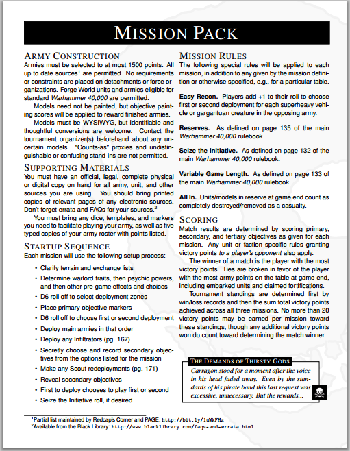
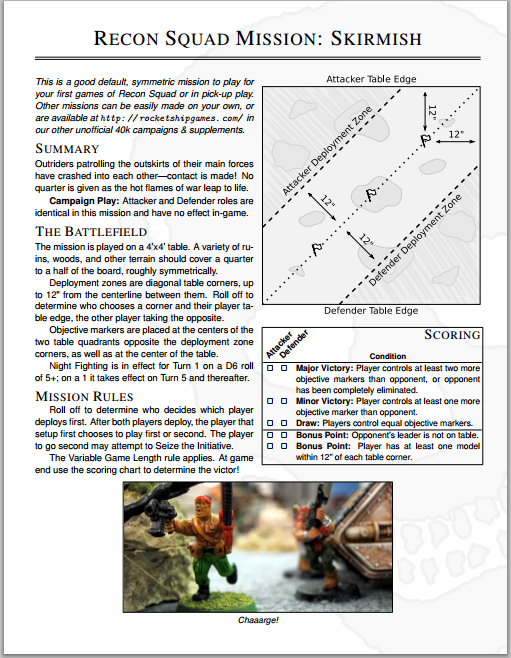

# 40k.cls

This repository provides a LaTeX file and a few associated graphics
for tournament packets, mission writeups, and fan supplements.

If you make use of this I'd absolutely love to hear about it!

Contact: [Joe Kopena](mailto:tjkopena@gmail.com),
[rocketshipgames.com/blogs/tjkopena/](http://rocketshipgames.com/blogs/tjkopena/)

## Examples

Some examples in use:
 * [Recon Squad](http://rocketshipgames.com/games/recon-squad/recon-squad.pdf)
 * [The Debacle on Caldor IV](http://www.pagegaming.com/index.php?n=Warhammer40k.20141122Tournament)

Pictures from those examples:

&nbsp;&nbsp;&nbsp;

## Documentation

The class currently provides a fairly small set of functionality.

In general it should do smart things about spacing.

### Document

Invoke the class using the `40k` class.  It has a single optional
parameter, `nobackground`, which disables the skull otherwise set on
the background of each page.  This is useful, e.g., in setting a page
of cards or a graphics-heavy page.

### Structure

For a variety of reasons, mostly related to getting shit done, the
class doesn't utilize the standard LaTeX structure commands.  It
instead provides the following:

    \pagetitle{foo}

Create a large banner with a black background for the given title
text.  This is intended to be used for top level sections of the
document, e.g., Rules versus Missions.

    \missiontitle{foo}

Create a large banner on a plain background with two rules underneath
for the given title text.  This is intended to be used for standalone
components within a top level section, e.g., mission specifications or
unit datasheets.

    \missionheading{foo}

Typeset the given title on its own line in a large small caps font.
This is intended for blocks of related text, e.g. "Deployment" and
"Objectives."

    \missionsubheading{foo}

Typeset the given title as a bold font inline paragraph start.  This
is intended mostly for particular rules, e.g., "Army of One" or
"Secondary Objective."

### Decorations

    \begin{story}{height}{foo}
      A tragic tale of a lone guardsman...
    \end{story}

Create a story block, filling the current line, featuring a nicely set
title, lightly grayed backgound, and of course an ornamental skull.
The first parameter is the height of the main text box.  The second
parameter is the title.  The main text is set within a minipage.

## License

All materials are released under the open source [MIT
license](http://opensource.org/licenses/MIT).  Do as you please with
them.
